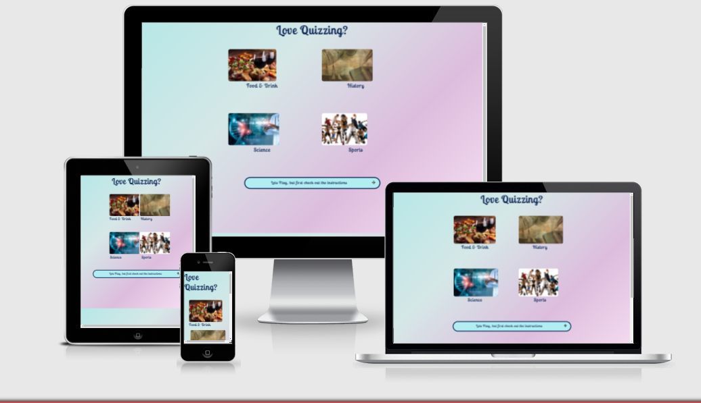
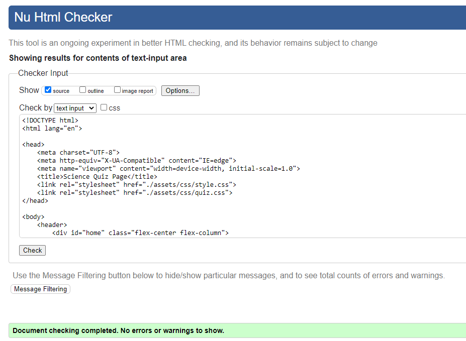
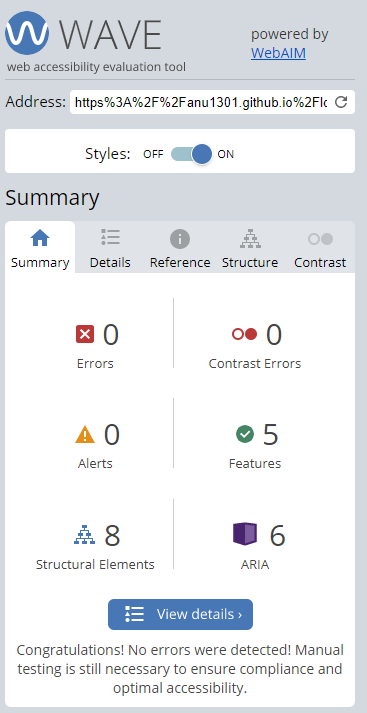

# Love Quizzing?

## Introduction
Online quizzes are becoming popular and there has been a growth in this market over the last couple of years, due to the Covid pandemic.

Quizzes have transitioned from the earliest publically organised quiz in the U.S. in the 1930s, through radio and television, and now online.

I was inspired to create a quiz because of my own love of quizzing.

A live website to my quiz can be found [here](https://anu1301.github.io/love-quizzing/).

## Table of Contents
[1. User Expereince (UX)](#ux)

[2. Colour Scheme](#colour-scheme)
 
[3. Wire Frames](#wireframes)

[4. Features](#features)

[5.Technologies Used](#technologies-used)

[6.Testing](#testing)

[7.Issues & Future Development](#issues-and-developments)

[8. Deployment](#deployment)

[9. Credits](#credits)

## 1. User Experience (UX)
[Go up to the top](#table-of-contents)

The aim was to design an online quiz game that would provide entertainment and knowledge at the same time.

The target audience the quiz is aimed at varies and is vast - any age from mid/late 20s to the over 50s.

The application provides four separate categories of questions - Food & Drink, History, Science and Sports, which have proven to be popular and gives the user a variety from which to choose.

Each separate category provides 10 questions with multiple choise answers. The user is able to only select one answer from a choise of four per question.

Once all the questions from a category are completed the user is directed to the end page where the final score is displayed and a simple form is provided for feedback purposes.

The application is simple to use and intuitive, and provides instruction on the home/landing page.

The application is responsive to various sized devices.

## 2. Colour Scheme
[Go up to the top](#table-of-contents)

The choice of background colour of pale blue transitioning into a pale magenta, provides a contrasting backdrop for the dark indigo font colour. 

It provides enough interest without it being distracting to the user.

The website was run through the WebAim Contrast Checker with the following result:

## 3. Wire Frames
[Go up to the top](#table-of-contents)

Balsamiq was used to create an initial skeletal/wire frame plan.

I had sketched out two different plans initially, as presented below:

### Home page of first idea.

### Quiz page of first idea

### Home page of second idea

#### Qiz page of second idea

### End page of first and second idea

The final design was a hybrid of the two ideas with additional features.

, 

## 4. Features
[Go up to the top](#table-of-contents)

The home/landing page presents the title of the site as a question "Love Quizzing?" Below this there are four images which represent the four categories of quizzes,

Each image acts as a responsive button which takes you to its corresponding quiz page when, clicked upon.

Below the categories is a collapsible information bar, which responds to the mouse hover by changing colour. It opens up an information section when the "plus" icon is clicked, and closes when the "minus" icon is clicked,

Each qui page provides you with the title of the quiz at the top of the page, below which there is a progress bar, a question tracker and a score tracker for the number of correct answers given.

The questions follow on and are given randomly, with the multiple choice answers below.

A correct answer returns with the answer bar turning green, and an incorrect answer returns with the bar turning red.

A home button below the answers will return you to the home page.

Once the quiz is complete, the user will be directed to the end page where the final score for correct answers is given. 

There is a simplet form to provide feedback, name and e-mail. These are required fields.

Again a home button is provided for the user to return to the home page to choose another category.

## 5. Technologies Used
[Go up to the top](#table-of-contents)

The following technologies where used:

- HTML
- CSS
- JavaScript

## 6. Testing
[Go up to the top](#table-of-contents) 

Chrome developer tools was used simultaneously whilst the website was being built, to ensure that any issues were picked up straight away.

W3C Markup was used to check for errors within the HTML pages. The final checks showed no errors.

index.html

Note that all the quiz pages are the same and have all been tested in the same way to produce the same result. Only one set of results are shown above.

end.html

W3C CSS was used to check for errors within style.css and quiz.css, with no errors showing at the end:

style.css

The warning shown in the error checker relates to the imported font styles from google.

quiz.css

JSHint was used to check for errors within the JavaScript code, with the following results for the final check:

I am not sure what the warnings mean, as I have tested the code through dev tools, and there appears to be adverse effects and the code is working as it should.

WebAim was also used to check accessibility, with the following results:

## 7. Issues & Future Developments
[Go up to the top](#table-of-contents) 

There are some noted issues which have been difficult to detect and rectify, in the time given.

The images on the home page appear slightly mis-aligned on smaller devices, and have very little spacing between them horizontally on an iPad type device.

The category text below the image has been difficult to align center to the image above.

There appears to be a colour band at the bottom of the web pages, which I have not been able to detect why it is there.

There has been consideration given to future developments, had this been a real quiz page. 

- A possibility of further categories of quiz. 

- Time limits being placed on answering the questions, to heighten the excitment of beating the clock. 

- Having a highest score 'Leader Board'

- Animated background

## 8. Deployment
[Go up to the top](#table-of-contents)

The site was deployed to GitHub pages, since the repository was created through GitHub, using the following method:

- Click on settings navigation bar under the Love Quizzing repository title.

- Select pages on the left-hand side menu

- Click on master branch and save

- This generates a link with the website live

- The live link can be found at the top of this document

## 9. Credits
[Go up to the top](#table-of-contents)

The images were taken from Adobe Stock on a free trial period basis.

I relied on James Q Quick and Brian Design tutorial for the quiz JavaScript code.

For the collapsible and linear gradient background, I used W3Schools.

I also used some code and ideas from my previous project "Mollies Boutique", as well as getting some ideas from the CI Love Maths project.

My mentor, Marcel Mulder, gave valuable feedback and ideas for improvement or experimentation.

