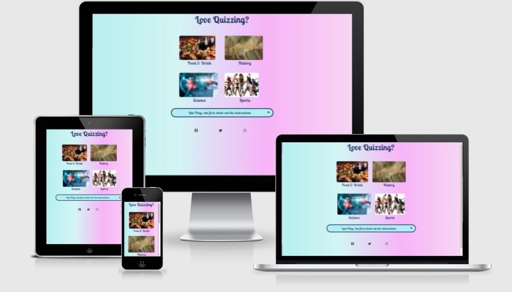
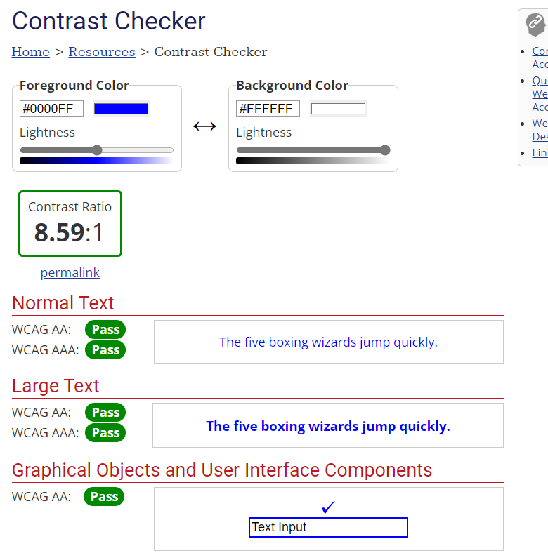
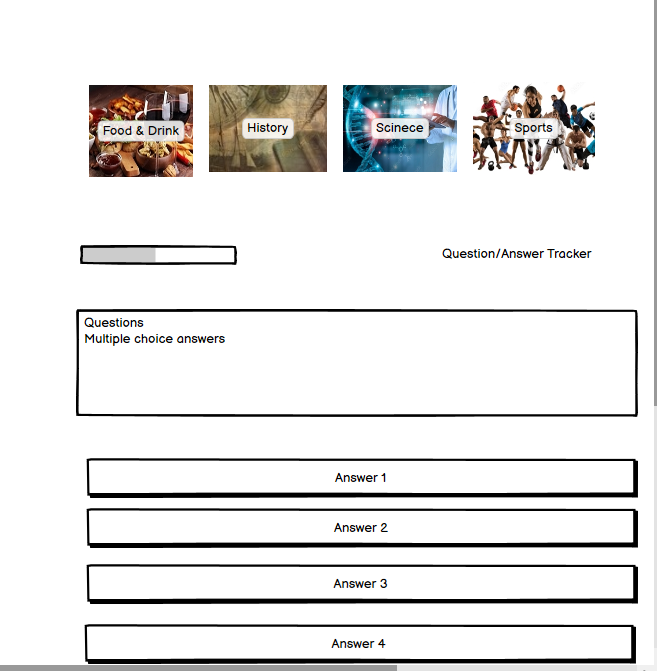

# Love Quizzing?

## Introduction
Online quizzes are becoming popular and there has been a growth in this market over the last couple of years, due to the Covid pandemic.

Quizzes have transitioned from the earliest publically organised quiz in the U.S. in the 1930s, through radio and television, and now online.

I was inspired to create a quiz because of my own love of quizzing.

A live website to my quiz can be found [here](https://anu1301.github.io/love-quizzing/).

## Table of Contents
[1. User Expereince (UX)](#ux)

[2. Colour Scheme](#colour-scheme)
 
[3. Wire Frames](#wireframes)

[4. Features](#features)

[5. Technologies Used](#technologies-used)

[6. Testing](#testing)

[7. Future Development](#developments)

[8. Deployment](#deployment)

[9. Credits](#credits)

## 1. User Experience (UX)
[Go up to the top](#table-of-contents)

The aim was to design an online quiz game that would provide entertainment and knowledge to a target audience varying from mid/late 20s to the over 50s. 

The aim of the website is to provide an application which the user can engage and interact with.

There are four separate categories of questions spanning a variety of interests - Food & Drink, History, Science and Sports.

Each separate category provides 10 questions with multiple choice answers. The user is able to only select one answer from a choice of four per question.

Once all the questions from a category are completed the user is directed to the end page where the final score is displayed and a simple form is provided for feedback purposes.

The application is simple to navigate and provides instruction on the home/landing page.

The application is responsive to various sized devices, thereby providing entertainment on the go.

## 2. Colour Scheme
[Go up to the top](#table-of-contents)

The choice of background colour of cyan transitioning into a magenta, provides a contrasting backdrop for the dark indigo font colour, and there is enough interest without being distracting.

The website was run through the WebAim Contrast Checker with the following result:

## 3. Wire Frames
[Go up to the top](#table-of-contents)

Balsamiq was used to create an initial skeletal/wire frame plan.

I had sketched out two different plans initially, as presented below:

##### Home page of first idea.

##### Quiz page of first idea

##### Home page of second idea

##### Quiz page of second idea

##### End page of first and second idea

The final design was a hybrid of the two ideas with additional features.

, 

## 4. Features
[Go up to the top](#table-of-contents)

The home/landing page presents the title of the site as a question "Love Quizzing?", which engages quiz lovers and on a subliminal level invites them to take part.

Below the title there are four images, representing the four quiz categories.

##### Home/Landing Page

Each image acts as a responsive button which takes you to its corresponding quiz page when selected. There is a hover effect that produces a box-shadow and slight movement, which gives the appearance of a raised button upon interaction with the user.

Below the categories is a collapsible information bar, which responds to the mouse hover by changing colour. It opens up an information section when the "plus" icon is selected, and closes when the "minus" icon is selected.

##### Collapsible Information Bar

Each quiz page provides you with the title of the quiz at the top of the page, below which there is a progress bar, a question tracker and a score tracker for the number of correct answers given.

##### Food & Drink Quiz Page

The questions follow on and are given randomly, with the multiple choice answers below.

##### History Quiz Page

A correct answer returns with the answer bar turning green, and an incorrect answer returns with the bar turning red.

##### Science Quiz Page

##### Sports Quiz Page

A home button below the answers will return you to the home page.

Once the quiz is complete, the user will be directed to the end page where the final score for correct answers is given.

##### End Page

There is a simple form to provide feedback, name and e-mail. These are required fields and the user will not be allowed to submit without completing them.

Again a home button is provided for the user to return to the home page to choose another category.

## 5. Technologies Used
[Go up to the top](#table-of-contents)

The following technologies where used:

- HTML - for the structure of the website
- CSS - for the layout and presentation of the website
- JavaScript - for the website interaction
- GitHub - creation and storage of the repository
- GitPod - code editor (code commited and pushed to GitHub)

## 6. Testing
[Go up to the top](#table-of-contents)

W3C Markup was used to check for errors in the HTML pages. The final checks showed no errors:

##### index.html

##### food-and-drink.html

##### history.html

##### science.html

##### sports.html

##### end.html

W3C CSS was used to check for errors in style.css and quiz.css. The final checks showed no errors:

##### style.css

The warning shown in the error checker relates to the imported font styles from google.

##### quiz.css

JSHint was used to check for errors in the JavaScript code with the following results:

#### before (for all the javascript files):

#### after

##### food-and-drink.js

history.js

##### science.js

##### sports.js

Siteimprove was used to check accessibility, with the following results:

Dev tools was also used to ensure that any issues were picked up and dealt with straight away.

### Manual Testing

The website was tested manually by loading the website on a Samsung smart phone as well as a Kindle tablet and was found to be responsive. 

This was also tested via dev tools as follows:

* Responsive dimentions (page was draged back and forth to reduce/increase size of viewport on desk-top screen)
* iPhone SE
* iPhone XR
* iPhone 12 Pro
* Samsung Galexy S8
* iPad Air
* iPad Mini

The website was tested using the following browsers:
* Microsoft Edge
* Google Chrome

The features were tested as follows:

* The images' links to their respective quiz pages were tested - they behaved as expected. They took you to the appropriate quiz pages.
* The collapsible information bar and instructions work as expected, i.e. when the plus sign is selected the instructions drop down. The colour also changes, as expected. When the minus sign is selected the instructions collapse and disappear.
* The social network icons, when selected, take you to their respective websites.
* The selection of answers on the quiz pages behave as they should - if the answer is correct, the selector turns green and if incorrect, turns red.
* The transition to the next question is short enough to stop the user breaking the system.
* The score at the top and the progress bar work as the questions are answered.
* Once all the questions have been answered the user is taken to the end page where the final score is shown - this works as expected.
* The name, email and text area for feedback are required fields - if not completed and the submit button is selected the user is prompted to complete these fields - this works as it should.
* The email field recognises the email format and prompts you if it has not been completed correctly.
* If the required fields are correctly completed and the submit button selected, the user is directed to the https://formdump.codeinstitute.net/ (the Code Institute form dump).
* The home button on the quiz page and the end page bring you back to the home page - this works as expected.

## 7. Future Developments
[Go up to the top](#table-of-contents) 

There has been consideration given to future developments and improvements.

- Having one html and one js file for all gategories of quiz, instead of four as is the case with this application.

- Provide further categories of quiz questions to reach a wider audiance. 

- Time limits being placed on answering the questions, to heighten the users' experience of beating the clock.

- Providing the correct answer if the wrong one is given.

- Having a highest score 'Leader Board'.

- A subtle animated background.

## 8. Deployment
[Go up to the top](#table-of-contents)

The site was deployed to GitHub pages, (as the repository was created through GitHub), using the following method:

- Navigate to the settings tab in the Love Quizzing? repository in GitHub.

- Select pages on the left-hand side menu

- From the source section drop-down menu, select the Master Branch and save

- The page will be automatically refreshed with a detailed ribbon display to indicate the successful deployment. 

- The live link can be found at the top of this document

## 9. Credits
[Go up to the top](#table-of-contents)

The images were taken from Adobe Stock on a free trial period basis.

I relied on James Q Quick and Brian Design tutorial for the quiz JavaScript code.

For the collapsible and linear gradient background, I used W3Schools.

I also used some code and ideas from my previous project "Mollies Boutique", as well as getting some ideas from the CI Love Maths project.

My mentor, Marcel Mulder, gave valuable feedback and ideas for improvement and experimentation. Also for his support and encouragement.

